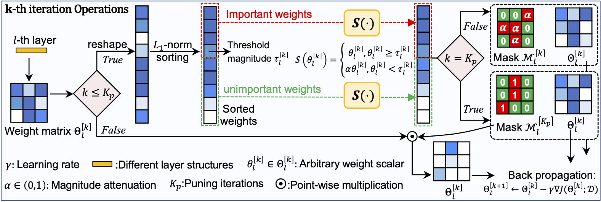
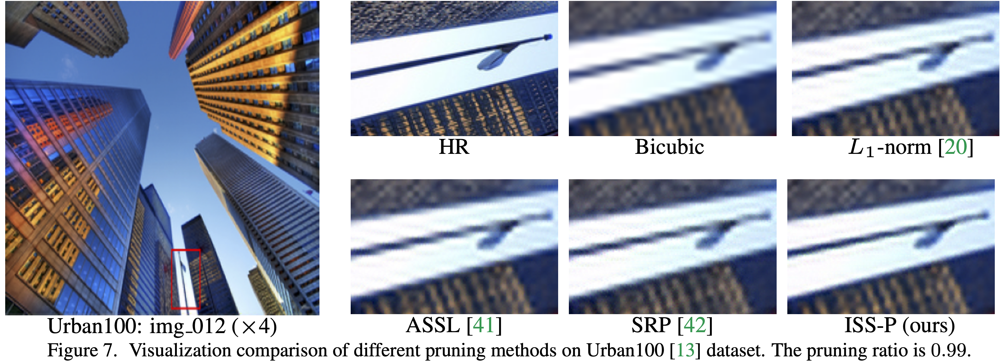
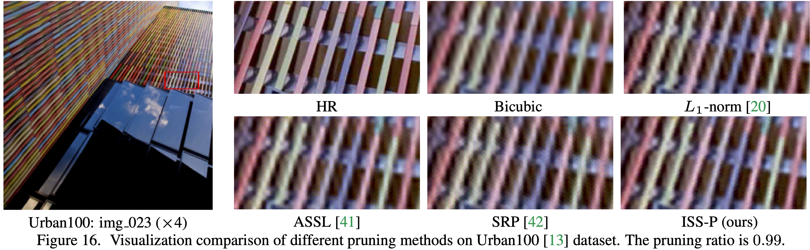

# Iterative Soft Shrinkage Learning for Efficient Image Super-Resolution

[Jiamian Wang](https://jiamian-wang.github.io/), [Huan Wang](https://huanwang.tech/), [Yulun Zhang](http://yulunzhang.com/), [Yun Fu](https://coe.northeastern.edu/people/fu-yun/), [Zhiqiang Tao](https://ztao.cc/), "Iterative Soft Shrinkage Learning for Efficient Image Super-Resolution", ICCV, 2023 (Poster)

[[ArXiv](https://arxiv.org/abs/2211.13654)] [[Pretrained Models](https://drive.google.com/drive/folders/15qmpQ9SffZxKEj-MYsyWbg04FYOYLmwX?usp=sharing)] [[Datasets](https://drive.google.com/file/d/1aXLvnz24JkzcuNMHvvn3uf5HCrXsYakH/view?usp=sharing)]  [[Results](https://github.com/Jiamian-Wang/IST_for_SR_pruning/tree/main/figures/visual_results)]

---

> **Abstract:** *The field of image super-resolution (SR) has witnessed
extensive neural network designs from CNN to transformer architectures. However, prevailing SR models suffer
from prohibitive memory footprint and intensive computations, which limits further deployment on computationalconstrained platforms. In this work, we investigate the potential of network pruning for super-resolution to take advantage of off-the-shelf network designs and reduce the underlying computational overhead. Two main challenges remain in applying pruning methods for SR. First, the widelyused filter pruning technique reflects limited granularity
and restricted adaptability to diverse network structures.
Second, existing pruning methods generally operate upon
a pre-trained network for the sparse structure determination, failing to get rid of dense model training in the traditional SR paradigm. To address these challenges, we
adopt unstructured pruning with sparse models directly
trained from scratch. Specifically, we propose a novel Iterative Soft Shrinkage-Percentage (ISS-P) method by optimizing the sparse structure of a randomly initialized network at each iteration and tweaking unimportant weights
with a small amount proportional to the magnitude scale
on-the-fly. We observe that the proposed ISS-P could dynamically learn sparse structures adapting to the optimization process and preserve the sparse model’s trainability by
yielding a more regularized gradient throughput. Experiments on benchmark datasets demonstrate the effectiveness
of the proposed ISS-P compared with state-of-the-art methods over diverse network architectures.*

>
> <p align="center">
> 
> </p>

---


## Content

1. [Dependencies](#Dependencies)
1. [Dataset](#Dataset)
1. [Pretrained-Models](#Pretrained-Models)
1. [Training](#Training)
1. [Testing](#Testing)
1. [Citation](#Citation)
1. [Acknowledgements](#Acknowledgements)

## Dependencies

- Python 3.8.15
- PyTorch 1.9 (Other versions, e.g., 1.12.1, also applies)
- CUDA 11.4

Clone the github repo and go to the default directory of IST_for_SR_pruning.
```shell
git clone git@github.com:Jiamian-Wang/IST_for_SR_pruning.git
```

Setup Anaconda (if needed)
```shell
wget https://repo.anaconda.com/archive/Anaconda3-2023.03-1-Linux-x86_64.sh
bash Anaconda3-2023.03-1-Linux-x86_64.sh
```

Create Conda environment from file

```shell
conda env create -f sr_pruning.yml
conda activate sr_pruning
```

Install PyTorch-GPU seperately if above installation fails 

```shell
pip3 install torch==1.9.0+cu111 torchvision==0.10.0+cu111 torchaudio==0.9.0 -f https://download.pytorch.org/whl/torch_stable.html
```

Before training and testing, run

```shell
python setup.py develop
```

## Dataset

- Training Set: We adopt [DIV2K](https://data.vision.ee.ethz.ch/cvl/DIV2K/)(800 training images) + [Flickr2K](https://cv.snu.ac.kr/research/EDSR/Flickr2K.tar)(2650 images). Complete training dataset [DF2K](https://drive.google.com/file/d/1TubDkirxl4qAWelfOnpwaSKoj3KLAIG4/view?usp=share_link).
- Testing Set:  Set5 + Set14 + BSD100 + Urban100 + Manga109 [complete testing dataset [download](https://drive.google.com/file/d/1yMbItvFKVaCT93yPWmlP3883XtJ-wSee/view?usp=sharing)]

For your convenience, we packaged training and testing data, easily download [datasets](https://drive.google.com/file/d/1aXLvnz24JkzcuNMHvvn3uf5HCrXsYakH/view?usp=sharing) to your local dependency outside the IST_for_SR_pruning.  


## Training 

`cd` the default directory of IST_for_SR_pruning. **Run setup script**.

```shell
python setup.py develop
```

* We provide both *Distributed (Multi-GPU) Training* and *Slurm Training*.

* For the distributed training
  * We recommend specify a maximum value of `OMP_NUM_THREADS` for each GPU to take full advantage of the dataloader.  
* For the Slurm training
  * An example of the Slurm training script is [here](https://github.com/Jiamian-Wang/IST_for_SR_pruning/blob/main/bash_example_slurm.sh).
  * More [examples](https://github.com/XPixelGroup/BasicSR/blob/master/docs/TrainTest.md) of the Slurm training commends.
  * For a detailed guidance for [Slurm](https://slurm.schedmd.com/quickstart.html). 


The training configurations are in `options/train/*.yml`. Specifically, 
* Specify the training and testing data directories in the yml files accordingly.
* A detailed yml configuration [instruction](https://github.com/XPixelGroup/BasicSR/blob/master/docs/Config.md#training-configuration)

### Hilights

1. Configurations

  * The `--stage_pr` plays the same role as `--stage_pr_lslen` plus `--stage_pr_lsval`. Feel free to use either setting. 

2. Efficiency

  * Both CAT-R and EDSR-L have a large amount of learnable parameters per layer, for which reason it is time-consuming to rank the weights when perform IST.
    For this scenario, we recommend to use efficient implementation of IST (`--prun_method IST-fast`) for a better cost-performance trade-off.
  * This is achieved by uniformly sample a subset of weights for a given layer, then determine the pruning threshold from the subset. 
  
3. N:M sparsity
   
  * Note that this code base support a naive implementation of the N:M sparsity for all weight pruning methods, simply by specifying `--pick_pruned` as `min_N:M`, which means the at least N elements to     be set as zeros for M consective values along a specific dimension.
  * This codebase allows extreme cases of N:M sparsity besides 2:4.  
  * Note that this configuration will rewrite the setting of the `--stage_pr` or `--stage_pr_lslen --stage_pr_lsval`. Here we provide a look-up table for the representative settings of Pr considering N:M sparsity

    |     | `--pick_pruned` | Pruning Ratio |
    |:--- |:---|:---|
    | 1   | min_2:4   | 0.5 | 
    | 2   | min_9:10  | 0.9 |
    | 3   | min_19:20 | 0.95|
    | 4   | min_89:90 | 0.988889 (0.99) | 

  * For more details, we recommend the white paper of [NVIDIA N:M sparsity](https://arxiv.org/pdf/2104.08378.pdf). 

### SwinIR-Lightweight

Distributed (Multi-GPU) Training 
```shell
# IST (proposed), x4, Pr=0.95
PYTHONPATH="./:${PYTHONPATH}"  CUDA_VISIBLE_DEVICES=0,1  python  -m  torch.distributed.launch  --nproc_per_node=2  --master_port=4321  basicsr/train_IST.py  --opt options/train/SwinIR/train_SwinIRLight_X4_DF2K_IST_pr0.95_lr0.0002.yml   --scale 4  --prune_method IST --prune_criterion l1-norm --compare_mode local   --wg weight  --same_pruned_wg_layers model.body.999 --stabilize_reg_interval 1  --reg_upper_limit 0.5 --ist_ratio 0.95  --update_reg_interval 20 --reg_granularity_prune 0.0001 --greg_mode part --skip_layers *mean* *tail*  --pick_pruned min_19:20

# IHT (proposed), x4, Pr=0.95, 2 GPUs
PYTHONPATH="./:${PYTHONPATH}"  CUDA_VISIBLE_DEVICES=0,1  python  -m  torch.distributed.launch  --nproc_per_node=2  --master_port=4321  basicsr/train_IST.py  --opt  options/train/SwinIR/train_SwinIRLight_X4_DF2K_IHT_pr0.95_lr0.0002.yml  --launcher pytorch --prune_method IHT --prune_criterion l1-norm  --pick_pruned min  --wg weight  --skip_layers *mean*  *tail* --compare_mode local --same_pruned_wg_layers model.body.999 --stabilize_reg_interval 1   --reg_upper_limit 0.5 --update_reg_interval 20 --reg_granularity_prune 0.0001 --greg_mode part --scale 4   --pick_pruned min_19:20

# SRP, x4, Pr=0.95, 2 GPUs
PYTHONPATH="./:${PYTHONPATH}"  CUDA_VISIBLE_DEVICES=0,1   python  -m  torch.distributed.launch  --nproc_per_node=2  --master_port=4321  basicsr/train_GReg.py  --scale 4  --opt options/train/SwinIR/train_SwinIRLight_X4_DF2K_SRP_pr0.95_lr0.0002.yml  --prune_method GReg-1 --prune_criterion l1-norm --compare_mode local  --wg weight   --same_pruned_wg_layers model.body.999  --stabilize_reg_interval 43150   --reg_upper_limit 0.5  --update_reg_interval 20  --reg_granularity_prune 0.0001 --greg_mode part --skip_layers *mean* *tail* --stage_pr [0-1000:0.950]  --pick_pruned min_19:20

# ASSL, x4, Pr=0.95, 2 GPUs
PYTHONPATH="./:${PYTHONPATH}"  CUDA_VISIBLE_DEVICES=0,1   python  -m  torch.distributed.launch --nproc_per_node=2 --master_port=4321  basicsr/train_ASSL.py  --opt options/train/SwinIR/train_SwinIRLight_X4_DF2K_ASSL_pr0.95_lr0.0002.yml  --launcher pytorch --prune_method ASSL --prune_criterion l1-norm   --wg weight  --skip_layers *mean*  *tail* --compare_mode local  --scale 4 --same_pruned_wg_layers *mlp* --same_pruned_wg_criterion reg --stabilize_reg_interval 43150 --reg_upper_limit 0.5 --update_reg_interval 20 --reg_granularity_prune 0.0001  --greg_mode part  --lw_spr 1e-8 --iter_ssa 17260  --stage_pr [0-1000:0.950] --pick_pruned min_19:20

# L1norm, x4, Pr=0.95, 2 GPUs
PYTHONPATH="./:${PYTHONPATH}"  CUDA_VISIBLE_DEVICES=0,1 python  -m  torch.distributed.launch  --nproc_per_node=2  --master_port=4321  basicsr/train_L1norm.py  --opt options/train/SwinIR/train_SwinIRLight_X4_DF2K_L1norm_pr0.95_lr0.0002.yml  --prune_method L1 --prune_criterion l1-norm --compare_mode local   --wg weight  --skip_layers *mean*  *tail* --scale 4 --stage_pr [0-1000:0.950]   --pick_pruned min_19:20

# Scratch, x4, Pr=0.95, 2 GPUs
PYTHONPATH="./:${PYTHONPATH}"  CUDA_VISIBLE_DEVICES=0,1  python  -m  torch.distributed.launch  --nproc_per_node=2  --master_port=4321  basicsr/train_L1norm.py    --opt options/train/SwinIR/train_SwinIRLight_X4_DF2K_scratch_pr0.95_lr0.0002.yml  --prune_method L1 --prune_criterion l1-norm --compare_mode local    --wg weight   --skip_layers *mean*  *tail* --scale 4  --reinit pth_reset  --stage_pr [0-1000:0.950]  --pick_pruned min_19:20
```

Slurm Training 
```shell
# IST (proposed), x4, Pr=0.95
srun python -u basicsr/train_IST.py  --launcher="slurm" --opt options/train/SwinIR/train_SwinIRLight_X4_DF2K_IST_pr0.95_lr0.0002.yml   --scale 4  --prune_method IST --prune_criterion l1-norm --compare_mode local   --wg weight  --same_pruned_wg_layers model.body.999 --stabilize_reg_interval 1  --reg_upper_limit 0.5 --ist_ratio 0.95  --update_reg_interval 20 --reg_granularity_prune 0.0001 --greg_mode part --skip_layers *mean* *tail*  --pick_pruned min_19:20

# IHT (proposed), x4, Pr=0.95, 2 GPUs
srun python -u basicsr/train_IST.py  --launcher="slurm" --opt  options/train/SwinIR/train_SwinIRLight_X4_DF2K_IHT_pr0.95_lr0.0002.yml  --launcher pytorch --prune_method IHT --prune_criterion l1-norm  --pick_pruned min  --wg weight  --skip_layers *mean*  *tail* --compare_mode local --same_pruned_wg_layers model.body.999 --stabilize_reg_interval 1   --reg_upper_limit 0.5 --update_reg_interval 20 --reg_granularity_prune 0.0001 --greg_mode part --scale 4   --pick_pruned min_19:20

# SRP, x4, Pr=0.95, 2 GPUs
srun python -u basicsr/train_GReg.py  --launcher="slurm" --opt options/train/SwinIR/train_SwinIRLight_X4_DF2K_SRP_pr0.95_lr0.0002.yml  --prune_method GReg-1 --prune_criterion l1-norm --compare_mode local  --wg weight   --same_pruned_wg_layers model.body.999  --stabilize_reg_interval 43150   --reg_upper_limit 0.5  --update_reg_interval 20  --reg_granularity_prune 0.0001 --greg_mode part --skip_layers *mean* *tail* --stage_pr [0-1000:0.950]  --pick_pruned min_19:20

# ASSL, x4, Pr=0.95, 2 GPUs
srun python -u basicsr/train_ASSL.py  --launcher="slurm" --opt options/train/SwinIR/train_SwinIRLight_X4_DF2K_ASSL_pr0.95_lr0.0002.yml  --launcher pytorch --prune_method ASSL --prune_criterion l1-norm   --wg weight  --skip_layers *mean*  *tail* --compare_mode local  --scale 4 --same_pruned_wg_layers *mlp* --same_pruned_wg_criterion reg --stabilize_reg_interval 43150 --reg_upper_limit 0.5 --update_reg_interval 20 --reg_granularity_prune 0.0001  --greg_mode part  --lw_spr 1e-8 --iter_ssa 17260  --stage_pr [0-1000:0.950] --pick_pruned min_19:20

# L1norm, x4, Pr=0.95, 2 GPUs
srun python -u basicsr/train_L1norm.py  --launcher="slurm" --opt options/train/SwinIR/train_SwinIRLight_X4_DF2K_L1norm_pr0.95_lr0.0002.yml  --prune_method L1 --prune_criterion l1-norm --compare_mode local   --wg weight  --skip_layers *mean*  *tail* --scale 4 --stage_pr [0-1000:0.950]   --pick_pruned min_19:20

# Scratch, x4, Pr=0.95, 2 GPUs
srun python -u basicsr/train_L1norm.py  --launcher="slurm" --opt options/train/SwinIR/train_SwinIRLight_X4_DF2K_scratch_pr0.95_lr0.0002.yml  --prune_method L1 --prune_criterion l1-norm --compare_mode local    --wg weight   --skip_layers *mean*  *tail* --scale 4  --reinit pth_reset  --stage_pr [0-1000:0.950]  --pick_pruned min_19:20

```

### EDSR-Large

Distributed (Multi-GPU) Training 
```shell
# IST-fast (proposed), x4, Pr=0.95, 2xGPUs
PYTHONPATH="./:${PYTHONPATH}"  CUDA_VISIBLE_DEVICES=0,1  python  -m  torch.distributed.launch  --nproc_per_node=2  --master_port=4321  basicsr/train_IST.py   --opt options/train/EDSR/train_EDSRL_X4_DF2K_ISTfast_pr0.95_lr0.0002.yml --prune_method IST-fast --prune_criterion l1-norm --compare_mode local   --wg weight --stage_pr [0-1000:0.950] --stage_pr_lslen 1000 --stage_pr_lsval 0.95 --same_pruned_wg_layers model.body.999 --stabilize_reg_interval 1  --reg_upper_limit 0.5 --ist_ratio 0.95  --update_reg_interval 20 --reg_granularity_prune 0.0001 --greg_mode part --skip_layers *none* --pick_pruned min


# IST (proposed), x4, Pr=0.95, 2xGPUs
PYTHONPATH="./:${PYTHONPATH}"  CUDA_VISIBLE_DEVICES=0,1  python  -m  torch.distributed.launch  --nproc_per_node=2  --master_port=4321  basicsr/train_IST.py  --opt options/train/EDSR/train_EDSRL_X4_DF2K_IST_pr0.95_lr0.0002.yml --prune_method IST --prune_criterion l1-norm --compare_mode local   --wg weight --stage_pr [0-1000:0.950] --stage_pr_lslen 1000 --stage_pr_lsval 0.95 --same_pruned_wg_layers model.body.999 --stabilize_reg_interval 1  --reg_upper_limit 0.5 --ist_ratio 0.95  --update_reg_interval 20 --reg_granularity_prune 0.0001 --greg_mode part --skip_layers *none*

# SRP, x4, Pr=0.95, 2xGPUs
PYTHONPATH="./:${PYTHONPATH}"  CUDA_VISIBLE_DEVICES=0,1  python  -m  torch.distributed.launch  --nproc_per_node=2  --master_port=4321  basicsr/train_GReg.py  --opt /home/jw4905/SR_pruning/options/train/EDSR/train_EDSRL_X4_DF2K_SRP_pr0.95_lr0.0002.yml --prune_method GReg-1 --prune_criterion l1-norm --compare_mode local   --wg weight --stage_pr [0-1000:0.950] --stage_pr_lslen 1000 --stage_pr_lsval 0.95 --same_pruned_wg_layers model.body.999 --stabilize_reg_interval 43150   --reg_upper_limit 0.5  --update_reg_interval 20 --reg_granularity_prune 0.0001 --greg_mode part --skip_layers *none*

# ASSL, x4, Pr=0.95, 2xGPUs
PYTHONPATH="./:${PYTHONPATH}"  CUDA_VISIBLE_DEVICES=0,1  python  -m  torch.distributed.launch  --nproc_per_node=2  --master_port=4321  basicsr/train_ASSL.py  --opt  options/train/EDSR/train_EDSRL_X4_DF2K_ASSL_pr0.95_lr0.0002.yml  --prune_method ASSL --prune_criterion l1-norm --compare_mode local   --wg weight  --stage_pr [0-1000:0.950]  --stage_pr_lslen 1000 --stage_pr_lsval 0.95 --skip_layers *none* --scale 4  --same_pruned_wg_layers  *conv*  --same_pruned_wg_criterion reg --stabilize_reg_interval 43150  --reg_upper_limit 0.5 --update_reg_interval 20 --reg_granularity_prune  0.0001 --greg_mode part --pick_pruned min  --lw_spr 1e-8  --iter_ssa 17260

# L1norm, x4, Pr=0.95, 2xGPUs
PYTHONPATH="./:${PYTHONPATH}"  CUDA_VISIBLE_DEVICES=0,1  python  -m  torch.distributed.launch  --nproc_per_node=2  --master_port=4321  basicsr/train_L1norm.py  --opt  options/train/EDSR/train_EDSRL_X4_DF2K_L1norm_pr0.95_lr0.0002.yml --prune_method L1 --prune_criterion l1-norm --compare_mode local   --wg weight  --stage_pr [0-1000:0.950] --stage_pr_lslen 1000 --stage_pr_lsval 0.95 --skip_layers *none* --scale 4

# Scratch, x4, Pr=0.95, 2xGPUs
PYTHONPATH="./:${PYTHONPATH}"  CUDA_VISIBLE_DEVICES=0,1  python  -m  torch.distributed.launch  --nproc_per_node=2  --master_port=4321  basicsr/train_L1norm.py  --opt  options/train/EDSR/train_EDSRL_X4_DF2K_scratch_pr0.95_lr0.0002.yml --prune_method L1 --prune_criterion l1-norm --compare_mode local   --wg weight  --stage_pr [0-1000:0.950] --stage_pr_lslen 1000 --stage_pr_lsval 0.95  --skip_layers *none* --scale 4 --reinit pth_reset
```

Slurm Training 
```shell
# IST-fast (proposed), x4, Pr=0.95, 2xGPUs
srun python -u basicsr/train_IST.py  --launcher="slurm" --scale 4  --opt options/train/EDSR/train_EDSRL_X4_DF2K_ISTfast_pr0.95_lr0.0002.yml --prune_method IST-fast --prune_criterion l1-norm --compare_mode local   --wg weight --stage_pr [0-1000:0.950] --stage_pr_lslen 1000 --stage_pr_lsval 0.95 --same_pruned_wg_layers model.body.999 --stabilize_reg_interval 1  --reg_upper_limit 0.5 --ist_ratio 0.95  --update_reg_interval 20 --reg_granularity_prune 0.0001 --greg_mode part --skip_layers *none* --pick_pruned min

# IST (proposed), x4, Pr=0.95, 2xGPUs
srun python -u basicsr/train_IST.py  --launcher="slurm" --scale 4  --opt options/train/EDSR/train_EDSRL_X4_DF2K_IST_pr0.95_lr0.0002.yml --prune_method IST --prune_criterion l1-norm --compare_mode local   --wg weight --stage_pr [0-1000:0.950] --stage_pr_lslen 1000 --stage_pr_lsval 0.95 --same_pruned_wg_layers model.body.999 --stabilize_reg_interval 1  --reg_upper_limit 0.5 --ist_ratio 0.95  --update_reg_interval 20 --reg_granularity_prune 0.0001 --greg_mode part --skip_layers *none*

# SRP, x4, Pr=0.95, 2xGPUs
srun python -u  basicsr/train_GReg.py  --launcher="slurm" --scale 4  --opt /home/jw4905/SR_pruning/options/train/EDSR/train_EDSRL_X4_DF2K_SRP_pr0.95_lr0.0002.yml --prune_method GReg-1 --prune_criterion l1-norm --compare_mode local   --wg weight --stage_pr [0-1000:0.950] --stage_pr_lslen 1000 --stage_pr_lsval 0.95 --same_pruned_wg_layers model.body.999 --stabilize_reg_interval 43150   --reg_upper_limit 0.5  --update_reg_interval 20 --reg_granularity_prune 0.0001 --greg_mode part --skip_layers *none*

# ASSL, x4, Pr=0.95, 2xGPUs
srun python -u basicsr/train_ASSL.py   --launcher="slurm" --opt  options/train/EDSR/train_EDSRL_X4_DF2K_ASSL_pr0.95_lr0.0002.yml  --prune_method ASSL --prune_criterion l1-norm --compare_mode local   --wg weight  --stage_pr [0-1000:0.950]  --stage_pr_lslen 1000 --stage_pr_lsval 0.95 --skip_layers *none* --scale 4  --same_pruned_wg_layers  *conv*  --same_pruned_wg_criterion reg --stabilize_reg_interval 43150  --reg_upper_limit 0.5 --update_reg_interval 20 --reg_granularity_prune  0.0001 --greg_mode part --pick_pruned min  --lw_spr 1e-8  --iter_ssa 17260

# L1norm, x4, Pr=0.95, 2xGPUs
srun python -u basicsr/train_L1norm.py  --launcher="slurm" --opt  options/train/EDSR/train_EDSRL_X4_DF2K_L1norm_pr0.95_lr0.0002.yml --prune_method L1 --prune_criterion l1-norm --compare_mode local   --wg weight  --stage_pr [0-1000:0.950] --stage_pr_lslen 1000 --stage_pr_lsval 0.95 --skip_layers *none* --scale 4

# Scratch, x4, Pr=0.95, 2xGPUs
srun python -u  basicsr/train_L1norm.py  --launcher="slurm" --opt  options/train/EDSR/train_EDSRL_X4_DF2K_scratch_pr0.95_lr0.0002.yml --prune_method L1 --prune_criterion l1-norm --compare_mode local   --wg weight  --stage_pr [0-1000:0.950] --stage_pr_lslen 1000 --stage_pr_lsval 0.95  --skip_layers *none* --scale 4 --reinit pth_reset

```

### CAT-R 

Distributed (Multi-GPU) Training 

```shell
# IST-fast (proposed), x4, Pr=0.95, 2xGPUs
PYTHONPATH="./:${PYTHONPATH}"  CUDA_VISIBLE_DEVICES=0,1  python  -m  torch.distributed.launch  --nproc_per_node=2  --master_port=4321  basicsr/train_IST.py --opt options/train/CAT/train_CATR_X4_DF2K_ISTfast_pr0.95_lr0.0002.yml --prune_method IST-fast --prune_criterion l1-norm --compare_mode local   --wg weight --stage_pr [0-1000:0.950] --stage_pr_lslen 1000 --stage_pr_lsval 0.95 --same_pruned_wg_layers model.body.999 --stabilize_reg_interval 1  --reg_upper_limit 0.5 --ist_ratio 0.95  --update_reg_interval 20 --reg_granularity_prune 0.0001 --greg_mode part --skip_layers *none* --pick_pruned min

# IST (proposed), x4, Pr=0.95, 2xGPUs
PYTHONPATH="./:${PYTHONPATH}"  CUDA_VISIBLE_DEVICES=0,1  python  -m  torch.distributed.launch  --nproc_per_node=2  --master_port=4321  basicsr/train_IST.py  --opt options/train/CAT/train_CATR_X4_DF2K_IST_pr0.95_lr0.0002.yml --prune_method IST --prune_criterion l1-norm --compare_mode local   --wg weight --stage_pr [0-1000:0.950] --stage_pr_lslen 1000 --stage_pr_lsval 0.95 --same_pruned_wg_layers model.body.999 --stabilize_reg_interval 1  --reg_upper_limit 0.5 --ist_ratio 0.95  --update_reg_interval 20 --reg_granularity_prune 0.0001 --greg_mode part --skip_layers *none*

# SRP, x4, Pr=0.95, 2xGPUs
PYTHONPATH="./:${PYTHONPATH}"  CUDA_VISIBLE_DEVICES=0,1  python  -m  torch.distributed.launch  --nproc_per_node=2  --master_port=4321  basicsr/train_GReg.py  --opt options/train/CAT/train_CATR_X4_DF2K_SRP_pr0.95_lr0.0002.yml --prune_method GReg-1 --prune_criterion l1-norm --compare_mode local   --wg weight --stage_pr [0-1000:0.950] --stage_pr_lslen 1000 --stage_pr_lsval 0.95 --same_pruned_wg_layers model.body.999 --stabilize_reg_interval 43150   --reg_upper_limit 0.5 --update_reg_interval 20 --reg_granularity_prune 0.0001 --greg_mode part --skip_layers *none*

# ASSL, x4, Pr=0.95, 2xGPUs
PYTHONPATH="./:${PYTHONPATH}"  CUDA_VISIBLE_DEVICES=0,1  python  -m  torch.distributed.launch  --nproc_per_node=2  --master_port=4321  basicsr/train_ASSL.py --opt options/train/CAT/train_CATR_X4_DF2K_ASSL_pr0.95_lr0.0002.yml --prune_method ASSL --prune_criterion l1-norm --compare_mode local   --wg weight  --stage_pr [0-1000:0.950] --stage_pr_lslen 1000 --stage_pr_lsval 0.95 --skip_layers *none* --scale 4 --same_pruned_wg_layers *mlp*  --same_pruned_wg_criterion reg --stabilize_reg_interval 43150  --reg_upper_limit 0.5 --update_reg_interval 20 --reg_granularity_prune 0.0001 --greg_mode part  --pick_pruned min  --lw_spr 1e-8  --iter_ssa 17260

# L1norm, x4, Pr=0.95, 2xGPUs
PYTHONPATH="./:${PYTHONPATH}"  CUDA_VISIBLE_DEVICES=0,1  python  -m  torch.distributed.launch  --nproc_per_node=2  --master_port=4321  basicsr/train_L1norm.py  --opt  options/train/CAT/train_CATR_X4_DF2K_L1norm_pr0.95_lr0.0002.yml --prune_method L1 --prune_criterion l1-norm --compare_mode local   --wg weight  --stage_pr [0-1000:0.950] --stage_pr_lslen 1000 --stage_pr_lsval 0.95 --skip_layers *none* --scale 4

# Scratch, x4, Pr=0.95, 2xGPUs
PYTHONPATH="./:${PYTHONPATH}"  CUDA_VISIBLE_DEVICES=0,1  python  -m  torch.distributed.launch  --nproc_per_node=2  --master_port=4321  basicsr/train_L1norm.py  --opt  options/train/CAT/train_CATR_X4_DF2K_scratch_pr0.95_lr0.0002.yml --prune_method L1 --prune_criterion l1-norm --compare_mode local   --wg weight  --stage_pr [0-1000:0.950] --stage_pr_lslen 1000 --stage_pr_lsval 0.95 --skip_layers *none* --scale 4 --reinit pth_reset

```

Slurm Training 
```shell
# IST-fast (proposed), x4, Pr=0.95, 2xGPUs
srun python -u basicsr/train_IST.py  --launcher="slurm" --scale 4  --opt options/train/CAT/train_CATR_X4_DF2K_ISTfast_pr0.95_lr0.0002.yml --prune_method IST-fast --prune_criterion l1-norm --compare_mode local   --wg weight --stage_pr [0-1000:0.950] --stage_pr_lslen 1000 --stage_pr_lsval 0.95 --same_pruned_wg_layers model.body.999 --stabilize_reg_interval 1  --reg_upper_limit 0.5 --ist_ratio 0.95  --update_reg_interval 20 --reg_granularity_prune 0.0001 --greg_mode part --skip_layers *none* --pick_pruned min

# IST (proposed), x4, Pr=0.95, 2xGPUs
srun python -u basicsr/train_IST.py  --launcher="slurm" --scale 4  --opt options/train/CAT/train_CATR_X4_DF2K_IST_pr0.95_lr0.0002.yml --prune_method IST --prune_criterion l1-norm --compare_mode local   --wg weight --stage_pr [0-1000:0.950] --stage_pr_lslen 1000 --stage_pr_lsval 0.95 --same_pruned_wg_layers model.body.999 --stabilize_reg_interval 1  --reg_upper_limit 0.5 --ist_ratio 0.95  --update_reg_interval 20 --reg_granularity_prune 0.0001 --greg_mode part --skip_layers *none*

# SRP, x4, Pr=0.95, 2xGPUs
srun python -u basicsr/train_GReg.py  --launcher="slurm" --scale 4  --opt options/train/CAT/train_CATR_X4_DF2K_SRP_pr0.95_lr0.0002.yml --prune_method GReg-1 --prune_criterion l1-norm --compare_mode local   --wg weight --stage_pr [0-1000:0.950] --stage_pr_lslen 1000 --stage_pr_lsval 0.95 --same_pruned_wg_layers model.body.999 --stabilize_reg_interval 43150   --reg_upper_limit 0.5 --update_reg_interval 20 --reg_granularity_prune 0.0001 --greg_mode part --skip_layers *none*

# ASSL, x4, Pr=0.95, 2xGPUs
srun python -u basicsr/train_ASSL.py  --launcher="slurm" --opt options/train/CAT/train_CATR_X4_DF2K_ASSL_pr0.95_lr0.0002.yml --prune_method ASSL --prune_criterion l1-norm --compare_mode local   --wg weight  --stage_pr [0-1000:0.950] --stage_pr_lslen 1000 --stage_pr_lsval 0.95 --skip_layers *none* --scale 4 --same_pruned_wg_layers *mlp*  --same_pruned_wg_criterion reg --stabilize_reg_interval 43150  --reg_upper_limit 0.5 --update_reg_interval 20 --reg_granularity_prune 0.0001 --greg_mode part  --pick_pruned min  --lw_spr 1e-8  --iter_ssa 17260

# L1norm, x4, Pr=0.95, 2xGPUs
srun python -u basicsr/train_L1norm.py  --launcher="slurm" --opt  options/train/CAT/train_CATR_X4_DF2K_L1norm_pr0.95_lr0.0002.yml --prune_method L1 --prune_criterion l1-norm --compare_mode local   --wg weight  --stage_pr [0-1000:0.950] --stage_pr_lslen 1000 --stage_pr_lsval 0.95 --skip_layers *none* --scale 4

# Scratch, x4, Pr=0.95, 2xGPUs
srun python -u basicsr/train_L1norm.py  --launcher="slurm" --opt  options/train/CAT/train_CATR_X4_DF2K_scratch_pr0.95_lr0.0002.yml --prune_method L1 --prune_criterion l1-norm --compare_mode local   --wg weight  --stage_pr [0-1000:0.950] --stage_pr_lslen 1000 --stage_pr_lsval 0.95 --skip_layers *none* --scale 4 --reinit pth_reset
```

## Testing 

Download all of the pretrained [models](https://drive.google.com/drive/folders/15qmpQ9SffZxKEj-MYsyWbg04FYOYLmwX?usp=sharing) under the default directory of IST_for_SR_pruning. 


`cd` the default directory of IST_for_SR_pruning. Run setup script.

```shell
python setup.py develop
```

### Hilights
1. Specify the testing data directories in the yml files accordingly.
2. The directories of pretrained models in yml files have been well prepared. 
3. We use SwinIR-Lightweight, x2 scale, Pr=0.99, as examples.
4. For other scales, pruning ratios, backbones, pruning methods, easily select and specify yml files from the `options/test`. 

### SwinIR-Lightweight

```shell
# IST, x2, Pr=0.99, 1xGPU
PYTHONPATH="./:${PYTHONPATH}"  CUDA_VISIBLE_DEVICES=0  python  -m torch.distributed.launch  --nproc_per_node=1 --master_port=4328  basicsr/test.py    --opt options/test/SwinIR/test_SwinIRLight_X2_DF2K_IST_pr0.99_lr0.0002.yml

# SRP, x2, Pr=0.99, 1xGPU
PYTHONPATH="./:${PYTHONPATH}"  CUDA_VISIBLE_DEVICES=0  python  -m torch.distributed.launch  --nproc_per_node=1 --master_port=4327  basicsr/test.py    --opt options/test/SwinIR/test_SwinIRLight_X2_DF2K_SRP_pr0.99_lr0.0002.yml

# ASSL, x2, Pr=0.99, 1xGPU
PYTHONPATH="./:${PYTHONPATH}"  CUDA_VISIBLE_DEVICES=1 python  -m torch.distributed.launch  --nproc_per_node=1 --master_port=4326  basicsr/test.py    --opt options/test/SwinIR/test_SwinIRLight_X2_DF2K_ASSL_pr0.99_lr0.0002.yml

# L1norm, x2, Pr=0.99, 1xGPU
PYTHONPATH="./:${PYTHONPATH}"  CUDA_VISIBLE_DEVICES=0  python  -m torch.distributed.launch  --nproc_per_node=1 --master_port=4325  basicsr/test.py    --opt options/test/SwinIR/test_SwinIRLight_X2_DF2K_L1norm_pr0.99_lr0.0002.yml

# Scratch, x2, Pr=0.99, 1xGPU
PYTHONPATH="./:${PYTHONPATH}"  CUDA_VISIBLE_DEVICES=0  python  -m torch.distributed.launch  --nproc_per_node=1 --master_port=4329  basicsr/test.py    --opt options/test/SwinIR/test_SwinIRLight_X2_DF2K_Scratch_pr0.99_lr0.0002.yml
```
## Visual Results

>
> <p align="center">
> 
> </p>

>
> <p align="center">
> 
> </p>


## Citation

Please kindly consider cite this paper in your publication if it helps your research or work:

```
@inproceedings{wang2023iterative,
  title={Iterative Soft Shrinkage Learning for Efficient Image Super-Resolution},
  author={Wang, Jiamian and Wang, Huan and Zhang, Yulun and Fu, Yun and Tao, Zhiqiang},
  booktitle={International Conference on Computer Vision (ICCV)},
  year={2023}
}
```


## Acknowledgements

This code is built on [BasicSR](https://github.com/XPixelGroup/BasicSR), [Restormer](https://github.com/swz30/Restormer), and [ASSL](https://github.com/MingSun-Tse/ASSL). Great thanks to them!


